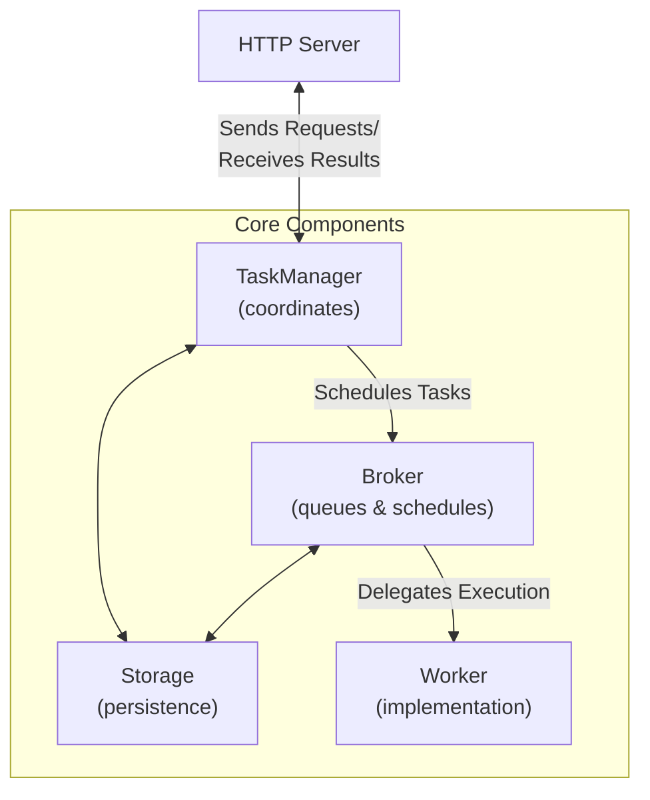

# Agent2Agent (A2A) Protocol

!!! warning "在 1.x 中已弃用，将在 2.0 中移除"
    `Agent.to_a2a()` 和 `pydantic-ai-slim[a2a]` extra 已弃用，并将在 2.0 中移除。`fasta2a` 包现在由 [datalayer/fasta2a](https://github.com/datalayer/fasta2a) 维护，并从 [v0.6.1](https://github.com/datalayer/fasta2a/releases/tag/v0.6.1) 开始提供 Pydantic AI bridge。请安装带 `pydantic-ai` extra 的版本，并直接使用 `agent_to_a2a`：

    ```bash
    pip/uv-add 'fasta2a[pydantic-ai]>=0.6.1'
    ```

    ```python
    from fasta2a.pydantic_ai import agent_to_a2a

    from pydantic_ai import Agent

    agent = Agent('openai:gpt-5.2', instructions='Be fun!')
    app = agent_to_a2a(agent)
    ```

[Agent2Agent (A2A) Protocol](https://a2a-protocol.org/) 是 Google 推出的开放标准，用于实现 AI agents 之间的通信和互操作，无论这些 agents 基于什么框架或供应商构建。

在 Pydantic，我们构建了 [FastA2A](#fasta2a) 库，让用 Python 实现 A2A protocol 更容易。它现在由 [datalayer/fasta2a](https://github.com/datalayer/fasta2a) 维护，并从 [v0.6.1](https://github.com/datalayer/fasta2a/releases/tag/v0.6.1) 开始提供 Pydantic AI bridge。请安装带 `pydantic-ai` extra 的版本，并使用 `agent_to_a2a` 将 Pydantic AI agent 暴露为 A2A server：

```py {title="agent_to_a2a.py"}
from fasta2a.pydantic_ai import agent_to_a2a

from pydantic_ai import Agent

agent = Agent('openai:gpt-5.2', instructions='Be fun!')
app = agent_to_a2a(agent)
```

_你可以用 `uvicorn agent_to_a2a:app --host 0.0.0.0 --port 8000` 运行此示例_

这会将 agent 暴露为 A2A server，随后你就可以开始向它发送请求。

关于[将 Pydantic AI agents 暴露为 A2A servers](#pydantic-ai-agent-to-a2a-server)，请阅读更多内容。

## FastA2A

**FastA2A** 是 A2A protocol 的 Python 实现，与具体 agentic framework 无关。该库被设计为可与任何 agentic framework 一起使用，并且**不专属于 Pydantic AI**。

### 设计 {#design}

**FastA2A** 构建在 [Starlette](https://www.starlette.io) 之上，因此完全兼容任何 ASGI server。

考虑到 A2A protocol 的性质，在使用前理解其设计很重要，因为作为开发者，你需要提供一些组件：

- [`Storage`][fasta2a.Storage]：保存和加载 tasks，并存储对话 context
- [`Broker`][fasta2a.Broker]：调度 tasks
- [`Worker`][fasta2a.Worker]：执行 tasks

下面看看这些组件如何协作：



FastA2A 允许你自带 [`Storage`][fasta2a.Storage]、[`Broker`][fasta2a.Broker] 和 [`Worker`][fasta2a.Worker]。

#### 理解 Tasks 和 Context {#understanding-tasks-and-context}

在 A2A protocol 中：

- **Task**：表示 agent 的一次完整执行。当 client 向 agent 发送消息时，会创建一个新 task。agent 会运行直到完成（或失败），整个执行过程都被视为一个 task。最终输出会存储为 task artifact。

- **Context**：表示可以跨越多个 tasks 的对话线程。A2A protocol 使用 `context_id` 维护对话连续性：
  - 发送新消息但没有 `context_id` 时，server 会生成一个新的
  - 后续消息可以包含相同的 `context_id` 以继续对话
  - 共享同一个 `context_id` 的所有 tasks 都可以访问完整 message history

#### Storage 架构 {#storage-architecture}

[`Storage`][fasta2a.Storage] 组件有两个用途：

1. **Task Storage**：以 A2A protocol 格式存储 tasks，包括 status、artifacts 和 message history
2. **Context Storage**：以针对具体 agent 实现优化的格式存储 conversation context

这种设计让 agents 既能存储丰富的内部状态（例如 tool calls、reasoning traces），也能存储特定 task 的 A2A 格式 messages 和 artifacts。

例如，Pydantic AI agent 可以在 context storage 中存储完整内部 message 格式（包括 tool calls 和 responses），同时在 task history 中只存储符合 A2A 的 messages。

### 安装 {#installation}

FastA2A 以 [`fasta2a`](https://pypi.org/project/fasta2a/) 的名称发布在 PyPI 上，因此安装很简单：

```bash
pip/uv-add fasta2a
```

它只有以下依赖：

- [starlette](https://www.starlette.io)：将 A2A server 暴露为 [ASGI application](https://asgi.readthedocs.io/en/latest/)
- [pydantic](https://pydantic.dev)：验证 request/response messages
- [opentelemetry-api](https://opentelemetry-python.readthedocs.io/en/latest)：提供 tracing 能力

安装包含 Pydantic AI bridge 的 **FastA2A**：

```bash
pip/uv-add 'fasta2a[pydantic-ai]>=0.6.1'
```

`pydantic-ai-slim[a2a]` extra 在 1.x 中仍可用于向后兼容，但已弃用并会在 2.0 中移除。

### Pydantic AI Agent 转 A2A Server {#pydantic-ai-agent-to-a2a-server}

要将 Pydantic AI agent 暴露为 A2A server，请使用 `fasta2a.pydantic_ai` 中的 [`agent_to_a2a`][fasta2a.pydantic_ai.agent_to_a2a]：

```python {title="agent_to_a2a.py"}
from fasta2a.pydantic_ai import agent_to_a2a

from pydantic_ai import Agent

agent = Agent('openai:gpt-5.2', instructions='Be fun!')
app = agent_to_a2a(agent)
```

由于 `app` 是 ASGI application，它可以与任何 ASGI server 一起使用。

```bash
uvicorn agent_to_a2a:app --host 0.0.0.0 --port 8000
```

`agent_to_a2a` 是一个便捷函数，接受与 [`FastA2A`][fasta2a.FastA2A] 构造函数相同的参数。

使用 `agent_to_a2a()` 时，Pydantic AI 会自动：

- 在 context storage 中存储完整 conversation history（包括 tool calls 和 responses）
- 确保带有相同 `context_id` 的后续 messages 可以访问完整 conversation history
- 将 agent 结果持久化为 A2A artifacts：
  - 字符串结果会变成 `TextPart` artifacts，并且也会出现在 message history 中
  - 结构化数据（Pydantic models、dataclasses、tuples 等）会变成 `DataPart` artifacts，数据会包装为 `{"result": <your_data>}`
  - artifacts 会包含带类型信息的 metadata，并在可用时包含 JSON schema
