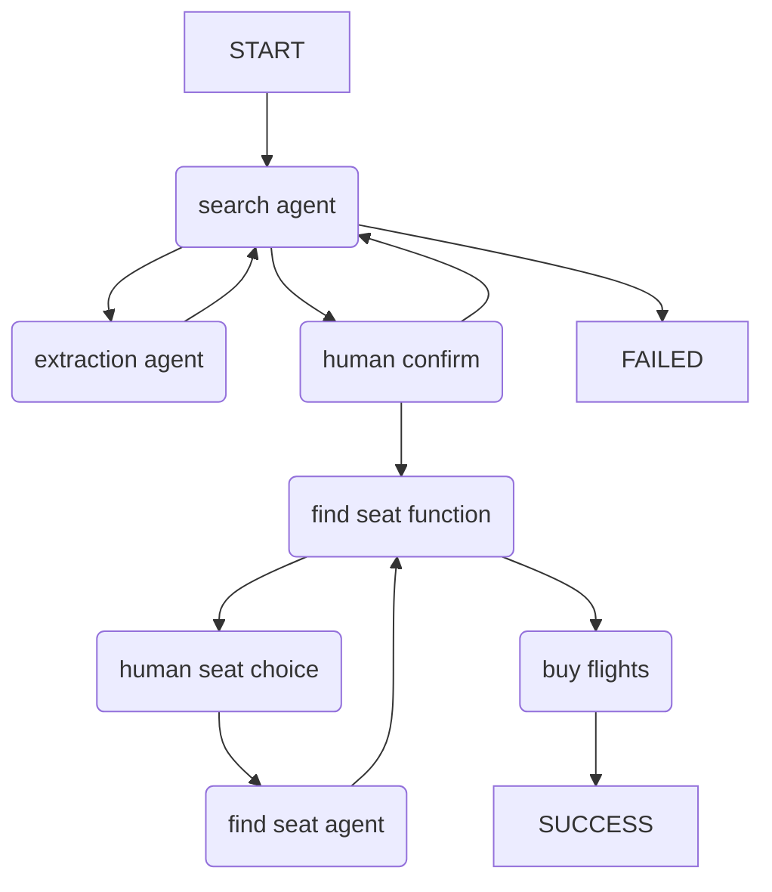

一个多智能体流程示例：一个智能体将工作委托给另一个智能体，然后把控制权移交给第三个智能体。

演示内容：

* [智能体委托](../multi-agent-applications.md#agent-delegation)
* [程序化智能体移交](../multi-agent-applications.md#programmatic-agent-hand-off)
* [用量限制](../agent.md#usage-limits)

在这个场景中，一组智能体协作，为用户找到最佳航班。

此示例的控制流可概括如下：



## 运行示例

在[安装依赖并设置环境变量](./setup.md#usage)后运行：

```bash
python/uv-run -m pydantic_ai_examples.flight_booking
```

## 示例代码

```snippet {path="/examples/pydantic_ai_examples/flight_booking.py"}```
