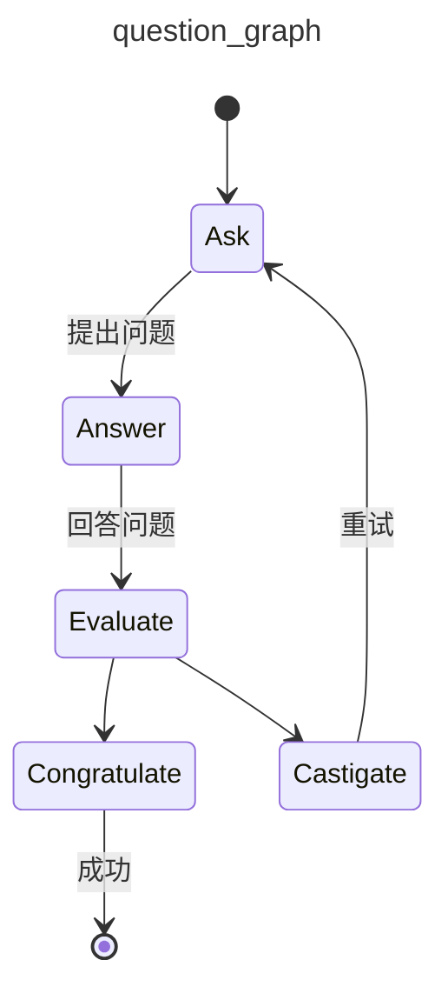

# 问题图

一个用于提问并评估答案的图示例。

演示内容：

* [`pydantic_graph`](../graph.md)

## 运行示例

在[安装依赖并设置环境变量](./setup.md#usage)后运行：

```bash
python/uv-run -m pydantic_ai_examples.question_graph
```

## 示例代码

```snippet {path="/examples/pydantic_ai_examples/question_graph.py"}```

此示例生成的 Mermaid 图如下：


