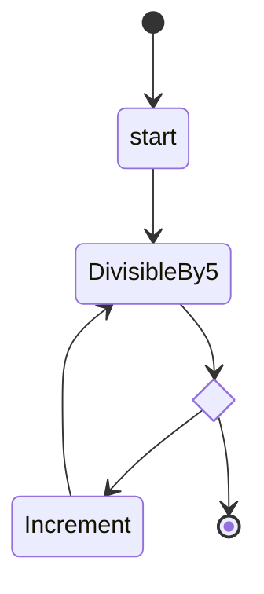
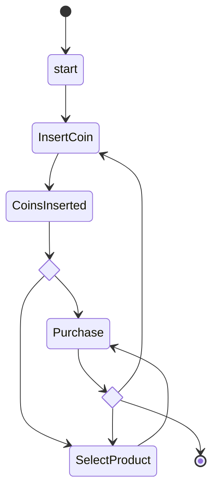
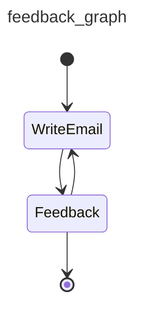

# 图

!!! danger "除非真的需要射钉枪，否则不要用射钉枪"
    如果 Pydantic AI [agents](agent.md) 是锤子，[多智能体工作流](multi-agent-applications.md)是大锤，那么 graphs 就是射钉枪：

    * 没错，射钉枪看起来比锤子酷
    * 但射钉枪需要比锤子多得多的准备工作
    * 射钉枪不会让你成为更好的建造者，只会让你成为一个拿着射钉枪的建造者
    * 最后（哪怕这个比喻已经被折磨得差不多了），如果你喜欢木槌和无类型 Python 这类中世纪工具，你大概不会喜欢射钉枪，也不会喜欢我们处理 graphs 的方式。（不过话说回来，如果你不喜欢 Python 类型提示，你可能早就离开 Pydantic AI，去用某个玩具 agent 框架了。祝好运；等你意识到自己需要大锤时，欢迎借我的。）

    简而言之，graphs 是强大的工具，但并不适合所有工作。继续之前，请先考虑其他[多智能体方案](multi-agent-applications.md)。

    如果你不确定基于 graph 的方法是个好主意，它可能就是不必要的。

Graphs 和有限状态机（FSMs）是用于建模、执行、控制和可视化复杂工作流的强大抽象。

在 Pydantic AI 之外，我们还开发了 `pydantic-graph`，这是一个面向 Python 的异步 graph 和状态机库，节点和边都使用类型提示定义。

虽然这个库是作为 Pydantic AI 的一部分开发的，但它不依赖 `pydantic-ai`，可以视为一个纯 graph-based 状态机库。无论你是否使用 Pydantic AI，甚至是否在构建 GenAI，它都可能有用。

`pydantic-graph` 面向高级用户设计，大量使用 Python generics 和类型提示。它并不打算像 Pydantic AI 一样对初学者友好。

## 安装 {#installation}

`pydantic-graph` 是 `pydantic-ai` 的必需依赖，也是 `pydantic-ai-slim` 的可选依赖；更多信息请参阅[安装说明](install.md#slim-install)。你也可以直接安装：

```bash
pip/uv-add pydantic-graph
```

## Graph 类型 {#graph-types}

`pydantic-graph` 由几个关键组件组成：

### GraphRunContext

[`GraphRunContext`][pydantic_graph.basenode.GraphRunContext] 是 graph run 的上下文，类似于 Pydantic AI 的 [`RunContext`][pydantic_ai.tools.RunContext]。它保存 graph 的 state 和 dependencies，并在节点运行时传给节点。

`GraphRunContext` 对它所在 graph 的 state 类型 [`StateT`][pydantic_graph.basenode.StateT] 是泛型的。

### End

[`End`][pydantic_graph.basenode.End] 是一个返回值，用于表示 graph run 应该结束。

`End` 对它所在 graph 的返回类型 [`RunEndT`][pydantic_graph.basenode.RunEndT] 是泛型的。

### Nodes

[`BaseNode`][pydantic_graph.basenode.BaseNode] 的子类定义 graph 中要执行的节点。

节点通常是 [`dataclass`es][dataclasses.dataclass]，一般包含：

- 调用节点时需要/可选的参数字段
- 在 [`run`][pydantic_graph.basenode.BaseNode.run] 方法中执行的业务逻辑
- [`run`][pydantic_graph.basenode.BaseNode.run] 方法的返回注解，`pydantic-graph` 会读取它们来确定该节点的出边

节点在这些维度上是泛型的：

- **state**，必须与包含它们的 graphs 的 state 类型相同；[`StateT`][pydantic_graph.basenode.StateT] 默认是 `None`，所以如果你不使用 state，可以省略这个泛型参数；更多信息见 [stateful graphs](#stateful-graphs)
- **deps**，必须与包含它们的 graph 的 deps 类型相同；[`DepsT`][pydantic_graph.basenode.DepsT] 默认是 `None`，所以如果你不使用 deps，可以省略这个泛型参数；更多信息见 [dependency injection](#dependency-injection)
- **graph 返回类型**，只在节点返回 [`End`][pydantic_graph.basenode.End] 时适用。[`RunEndT`][pydantic_graph.basenode.RunEndT] 默认是 [Never][typing.Never]，所以如果节点不返回 `End`，可以省略这个泛型参数；如果返回 `End`，则必须包含它。

下面是 graph 中一个起始或中间节点的示例；它不能结束运行，因为它不返回 [`End`][pydantic_graph.basenode.End]：

```py {title="intermediate_node.py" noqa="F821" test="skip"}
from dataclasses import dataclass

from pydantic_graph import BaseNode, GraphRunContext


@dataclass
class MyNode(BaseNode[MyState]):  # (1)!
    foo: int  # (2)!

    async def run(
        self,
        ctx: GraphRunContext[MyState],  # (3)!
    ) -> AnotherNode:  # (4)!
        ...
        return AnotherNode()
```

1. 此示例中的 state 是 `MyState`（未展示），因此 `BaseNode` 使用 `MyState` 作为参数。这个节点不能结束运行，所以省略 `RunEndT` 泛型参数，它会默认为 `Never`。
2. `MyNode` 是一个 dataclass，只有一个 `int` 字段 `foo`。
3. `run` 方法接收一个 `GraphRunContext` 参数，同样以 state `MyState` 参数化。
4. `run` 方法的返回类型是 `AnotherNode`（未展示），这会用于确定该节点的出边。

我们可以扩展 `MyNode`，让它在 `foo` 能被 5 整除时可选地结束运行：

```py {title="intermediate_or_end_node.py" hl_lines="7 13 15" noqa="F821" test="skip"}
from dataclasses import dataclass

from pydantic_graph import BaseNode, End, GraphRunContext


@dataclass
class MyNode(BaseNode[MyState, None, int]):  # (1)!
    foo: int

    async def run(
        self,
        ctx: GraphRunContext[MyState],
    ) -> AnotherNode | End[int]:  # (2)!
        if self.foo % 5 == 0:
            return End(self.foo)
        else:
            return AnotherNode()
```

1. 我们除了 state 之外，还用返回类型（这里是 `int`）参数化节点。因为泛型参数只能按位置传入，所以必须把 `None` 作为第二个参数来表示 deps。
2. `run` 方法的返回类型现在是 `AnotherNode` 和 `End[int]` 的 union，这允许节点在 `foo` 能被 5 整除时结束运行。

### Graph

[`Graph`][pydantic_graph.graph_builder.Graph] 是由 [`GraphBuilder`][pydantic_graph.graph_builder.GraphBuilder] 产生的可执行 graph。builder 是从 [step functions](graph/builder/steps.md)、[`BaseNode`](#nodes) 类和连接它们的边组装 graph 的入口点。

[`GraphBuilder`][pydantic_graph.graph_builder.GraphBuilder] 在这些维度上是泛型的：

- **state**，graph 的 state 类型 [`StateT`][pydantic_graph.basenode.StateT]
- **deps**，graph 的 deps 类型 [`DepsT`][pydantic_graph.basenode.DepsT]
- **input**，传给 graph 的初始输入类型 `InputT`
- **output**，graph 产生的最终输出类型 `OutputT`

下面是一个由两个 `BaseNode` 子类构建的简单 graph 示例：

```py {title="graph_example.py"}
from __future__ import annotations

from dataclasses import dataclass

from pydantic_graph import BaseNode, End, GraphBuilder, GraphRunContext, StepContext


@dataclass
class DivisibleBy5(BaseNode[None, None, int]):  # (1)!
    foo: int

    async def run(
        self,
        ctx: GraphRunContext,
    ) -> Increment | End[int]:
        if self.foo % 5 == 0:
            return End(self.foo)
        else:
            return Increment(self.foo)


@dataclass
class Increment(BaseNode):  # (2)!
    foo: int

    async def run(self, ctx: GraphRunContext) -> DivisibleBy5:
        return DivisibleBy5(self.foo + 1)


g = GraphBuilder(input_type=int, output_type=int)  # (3)!


@g.step
async def start(ctx: StepContext[None, None, int]) -> DivisibleBy5:  # (4)!
    return DivisibleBy5(ctx.inputs)


g.add(
    g.node(DivisibleBy5),  # (5)!
    g.node(Increment),
    g.edge_from(g.start_node).to(start),  # (6)!
)

fives_graph = g.build()  # (7)!


async def main():
    result = await fives_graph.run(inputs=4)  # (8)!
    print(result)
    #> 5
```

1. `DivisibleBy5` 节点的 state 参数和 deps 参数都是 `None`，因为这个 graph 不使用 state 或 deps；它用 `int` 参数化，因为它可以结束运行。
2. `Increment` 节点不返回 `End`，所以省略了 `RunEndT` 泛型参数；由于 graph 不使用 state，也可以省略 state。
3. 创建 [`GraphBuilder`][pydantic_graph.graph_builder.GraphBuilder]，声明 graph 的 input 和 output 类型。
4. 定义一个 [step](graph/builder/steps.md)，把初始输入包装为第一个 `BaseNode`。当执行离开 [`g.start_node`][pydantic_graph.graph_builder.GraphBuilder.start_node] 时，builder 会调用它。
5. 使用 [`g.node()`][pydantic_graph.graph_builder.GraphBuilder.node] 注册每个 `BaseNode` 子类，让 builder 知道它们；出边会从每个节点的 `run` 返回类型推断。
6. 将 start node 连接到入口 step。
7. [`g.build()`][pydantic_graph.graph_builder.GraphBuilder.build] 返回一个可以执行的 [`Graph`][pydantic_graph.graph_builder.Graph]。
8. [`graph.run()`][pydantic_graph.graph_builder.Graph.run] 是异步的，并返回原始输出值（`End` 节点返回的 `int`）。

_（这个示例是完整的，可以"按原样"运行；你需要添加 `import asyncio; asyncio.run(main())` 来运行 `main`）_

这个 graph 的 [mermaid 图](#mermaid-diagrams)可以通过 `print(fives_graph)` 生成，也可以调用 [`fives_graph.render()`][pydantic_graph.graph_builder.Graph.render]：



## Stateful Graphs {#stateful-graphs}

`pydantic-graph` 中的 "state" 概念提供了一种可选方式，让节点在 graph 中运行时可以访问并修改某个对象（通常是 `dataclass` 或 Pydantic model）。如果把 Graphs 想成生产线，那么 state 就是沿生产线传递并由每个节点在 graph 运行时逐步构建的引擎。

下面是一个表示自动售货机的 graph 示例，用户可以投币并选择要购买的商品。

```python {title="vending_machine.py"}
from __future__ import annotations

from dataclasses import dataclass

from rich.prompt import Prompt

from pydantic_graph import BaseNode, End, GraphBuilder, GraphRunContext, StepContext


@dataclass
class MachineState:  # (1)!
    user_balance: float = 0.0
    product: str | None = None


@dataclass
class InsertCoin(BaseNode[MachineState]):  # (3)!
    async def run(self, ctx: GraphRunContext[MachineState]) -> CoinsInserted:  # (14)!
        return CoinsInserted(float(Prompt.ask('Insert coins')))  # (4)!


@dataclass
class CoinsInserted(BaseNode[MachineState]):
    amount: float  # (5)!

    async def run(
        self, ctx: GraphRunContext[MachineState]
    ) -> SelectProduct | Purchase:  # (15)!
        ctx.state.user_balance += self.amount  # (6)!
        if ctx.state.product is not None:  # (7)!
            return Purchase(ctx.state.product)
        else:
            return SelectProduct()


@dataclass
class SelectProduct(BaseNode[MachineState]):
    async def run(self, ctx: GraphRunContext[MachineState]) -> Purchase:
        return Purchase(Prompt.ask('Select product'))


PRODUCT_PRICES = {  # (2)!
    'water': 1.25,
    'soda': 1.50,
    'crisps': 1.75,
    'chocolate': 2.00,
}


@dataclass
class Purchase(BaseNode[MachineState, None, None]):  # (16)!
    product: str

    async def run(
        self, ctx: GraphRunContext[MachineState]
    ) -> End | InsertCoin | SelectProduct:
        if price := PRODUCT_PRICES.get(self.product):  # (8)!
            ctx.state.product = self.product  # (9)!
            if ctx.state.user_balance >= price:  # (10)!
                ctx.state.user_balance -= price
                return End(None)
            else:
                diff = price - ctx.state.user_balance
                print(f'Not enough money for {self.product}, need {diff:0.2f} more')
                #> Not enough money for crisps, need 0.75 more
                return InsertCoin()  # (11)!
        else:
            print(f'No such product: {self.product}, try again')
            return SelectProduct()  # (12)!


g = GraphBuilder(state_type=MachineState)  # (13)!


@g.step
async def start(ctx: StepContext[MachineState, None, None]) -> InsertCoin:
    return InsertCoin()


g.add(
    g.node(InsertCoin),
    g.node(CoinsInserted),
    g.node(SelectProduct),
    g.node(Purchase),
    g.edge_from(g.start_node).to(start),
)

vending_machine_graph = g.build()


async def main():
    state = MachineState()  # (17)!
    await vending_machine_graph.run(state=state)  # (18)!
    print(f'purchase successful item={state.product} change={state.user_balance:0.2f}')
    #> purchase successful item=crisps change=0.25
```

1. 自动售货机的 state 被定义为 dataclass，包含用户余额以及他们选择的商品（如果有）。
2. 一个从商品映射到价格的字典。
3. `InsertCoin` 节点，[`BaseNode`][pydantic_graph.basenode.BaseNode] 使用 `MachineState` 参数化，因为这是该 graph 使用的 state。
4. `InsertCoin` 节点提示用户投币。为保持简单，这里只输入一个 float 金额。
5. `CoinsInserted` 节点同样是一个 [`dataclass`][dataclasses.dataclass]，有一个字段 `amount`。
6. 用投入金额更新用户余额。
7. 如果用户已经选择了商品，则进入 `Purchase`，否则进入 `SelectProduct`。
8. 在 `Purchase` 节点中，如果用户输入了有效商品，就查找商品价格。
9. 如果用户确实输入了有效商品，把商品设置到 state 中，这样就不会再次访问 `SelectProduct`。
10. 如果余额足以购买商品，调整余额以反映购买，并返回 [`End`][pydantic_graph.basenode.End] 结束 graph。这里不使用 run 返回类型，所以用 `None` 调用 `End`。
11. 如果余额不足，进入 `InsertCoin`，提示用户继续投币。
12. 如果商品无效，进入 `SelectProduct`，提示用户重新选择商品。
13. 使用 [`GraphBuilder`][pydantic_graph.graph_builder.GraphBuilder] 构建 graph，并声明 `MachineState` 类型。每个 `BaseNode` 子类都用 [`g.node()`][pydantic_graph.graph_builder.GraphBuilder.node] 注册；出边从 `run` 返回类型推断。`start` step 构造第一个节点。
14. 节点 [`run`][pydantic_graph.basenode.BaseNode.run] 方法的返回类型很重要，因为它用于确定该节点的出边。这些信息也用于渲染 [mermaid diagrams](#mermaid-diagrams)，并在运行时强制检查，以尽早发现错误行为。
15. `CoinsInserted` 的 [`run`][pydantic_graph.basenode.BaseNode.run] 方法返回类型是 union，表示可能有多条出边。
16. 与其他节点不同，`Purchase` 可以结束运行，所以必须设置 [`RunEndT`][pydantic_graph.basenode.RunEndT] 泛型参数。这里是 `None`，因为 graph run 返回类型是 `None`。
17. 初始化 state。它会传给 graph run，并在 graph 运行时被修改。
18. 使用初始 state 运行 graph。第一个要执行的节点由我们连接到 [`g.start_node`][pydantic_graph.graph_builder.GraphBuilder.start_node] 的 `start` step 决定。

_（这个示例是完整的，可以"按原样"运行；你需要添加 `import asyncio; asyncio.run(main())` 来运行 `main`）_

这个 graph 的 [mermaid 图](#mermaid-diagrams)可以通过 `print(vending_machine_graph)` 生成：



有关生成图表的更多信息，请参见[下文](#mermaid-diagrams)。

## GenAI 示例 {#genai-example}

到目前为止，我们还没有展示一个真正使用 Pydantic AI 或 GenAI 的 Graph 示例。

在这个示例中，一个 agent 为用户生成欢迎邮件，另一个 agent 对邮件提供反馈。

这个 graph 的结构非常简单：



```python {title="genai_email_feedback.py"}
from __future__ import annotations as _annotations

from dataclasses import dataclass, field

from pydantic import BaseModel, EmailStr

from pydantic_ai import Agent, ModelMessage, format_as_xml
from pydantic_graph import BaseNode, End, GraphBuilder, GraphRunContext, StepContext


@dataclass
class User:
    name: str
    email: EmailStr
    interests: list[str]


@dataclass
class Email:
    subject: str
    body: str


@dataclass
class State:
    user: User
    write_agent_messages: list[ModelMessage] = field(default_factory=list)


email_writer_agent = Agent(
    'google:gemini-3-pro-preview',
    output_type=Email,
    instructions='Write a welcome email to our tech blog.',
)


@dataclass
class WriteEmail(BaseNode[State]):
    email_feedback: str | None = None

    async def run(self, ctx: GraphRunContext[State]) -> Feedback:
        if self.email_feedback:
            prompt = (
                f'Rewrite the email for the user:\n'
                f'{format_as_xml(ctx.state.user)}\n'
                f'Feedback: {self.email_feedback}'
            )
        else:
            prompt = (
                f'Write a welcome email for the user:\n'
                f'{format_as_xml(ctx.state.user)}'
            )

        result = await email_writer_agent.run(
            prompt,
            message_history=ctx.state.write_agent_messages,
        )
        ctx.state.write_agent_messages += result.new_messages()
        return Feedback(result.output)


class EmailRequiresWrite(BaseModel):
    feedback: str


class EmailOk(BaseModel):
    pass


feedback_agent = Agent[None, EmailRequiresWrite | EmailOk](
    'openai:gpt-5.2',
    output_type=EmailRequiresWrite | EmailOk,  # type: ignore
    instructions=(
        'Review the email and provide feedback, email must reference the users specific interests.'
    ),
)


@dataclass
class Feedback(BaseNode[State, None, Email]):
    email: Email

    async def run(
        self,
        ctx: GraphRunContext[State],
    ) -> WriteEmail | End[Email]:
        prompt = format_as_xml({'user': ctx.state.user, 'email': self.email})
        result = await feedback_agent.run(prompt)
        if isinstance(result.output, EmailRequiresWrite):
            return WriteEmail(email_feedback=result.output.feedback)
        else:
            return End(self.email)


g = GraphBuilder(state_type=State, output_type=Email)


@g.step
async def start(ctx: StepContext[State, None, None]) -> WriteEmail:
    return WriteEmail()


g.add(
    g.node(WriteEmail),
    g.node(Feedback),
    g.edge_from(g.start_node).to(start),
)

feedback_graph = g.build()


async def main():
    user = User(
        name='John Doe',
        email='john.joe@example.com',
        interests=['Haskel', 'Lisp', 'Fortran'],
    )
    state = State(user)
    result = await feedback_graph.run(state=state)
    print(result)
    """
    Email(
        subject='Welcome to our tech blog!',
        body='Hello John, Welcome to our tech blog! ...',
    )
    """
```

_（这个示例是完整的，可以"按原样"运行；你需要添加 `asyncio.run(main())` 来运行 `main`）_

## 迭代 Graph {#iterating-over-a-graph}

如果要逐步执行、检查每个任务运行情况、覆盖下一步，或手动驱动循环，请使用 [`graph.iter()`][pydantic_graph.graph_builder.Graph.iter]，而不是 [`graph.run()`][pydantic_graph.graph_builder.Graph.run]。迭代模型和示例请参阅 graph builder 文档中的[高级执行控制](graph/builder/index.md#advanced-execution-control)。

## 依赖注入 {#dependency-injection}

与 Pydantic AI 一样，`pydantic-graph` 支持依赖注入。向 [`GraphBuilder`][pydantic_graph.graph_builder.GraphBuilder] 传入 `deps_type`，用 deps 类型参数化每个 [`BaseNode`][pydantic_graph.basenode.BaseNode] 子类，并在 `run()` 内通过 [`GraphRunContext.deps`][pydantic_graph.basenode.GraphRunContext.deps] 读取它（或在 step functions 内通过 [`StepContext.deps`][pydantic_graph.step.StepContext] 读取）。

举例来说，我们修改[上面](#graph)的 `DivisibleBy5` 示例，使用 [`ProcessPoolExecutor`][concurrent.futures.ProcessPoolExecutor] 在单独进程中运行计算负载（这是一个刻意设计的示例，`ProcessPoolExecutor` 在这个例子里其实不会提升性能）：

```py {title="deps_example.py" test="skip" hl_lines="4 8 14-16 39-44 49 56-58"}
from __future__ import annotations

import asyncio
from concurrent.futures import ProcessPoolExecutor
from dataclasses import dataclass

from pydantic_graph import BaseNode, End, GraphBuilder, GraphRunContext, StepContext


@dataclass
class GraphDeps:
    executor: ProcessPoolExecutor


@dataclass
class DivisibleBy5(BaseNode[None, GraphDeps, int]):
    foo: int

    async def run(
        self,
        ctx: GraphRunContext[None, GraphDeps],
    ) -> Increment | End[int]:
        if self.foo % 5 == 0:
            return End(self.foo)
        else:
            return Increment(self.foo)


@dataclass
class Increment(BaseNode[None, GraphDeps]):
    foo: int

    async def run(self, ctx: GraphRunContext[None, GraphDeps]) -> DivisibleBy5:
        loop = asyncio.get_running_loop()
        compute_result = await loop.run_in_executor(
            ctx.deps.executor,
            self.compute,
        )
        return DivisibleBy5(compute_result)

    def compute(self) -> int:
        return self.foo + 1


g = GraphBuilder(deps_type=GraphDeps, input_type=int, output_type=int)


@g.step
async def start(ctx: StepContext[None, GraphDeps, int]) -> DivisibleBy5:
    return DivisibleBy5(ctx.inputs)


g.add(
    g.node(DivisibleBy5),
    g.node(Increment),
    g.edge_from(g.start_node).to(start),
)

fives_graph = g.build()


async def main():
    with ProcessPoolExecutor() as executor:
        deps = GraphDeps(executor)
        result = await fives_graph.run(inputs=3, deps=deps)
    print(result)
    #> 5
```

_（这个示例是完整的，可以"按原样"运行；你需要添加 `asyncio.run(main())` 来运行 `main`）_

## Mermaid 图 {#mermaid-diagrams}

Pydantic Graph 可以为任何已构建的 graph 渲染 [mermaid](https://mermaid.js.org/) [`stateDiagram-v2`](https://mermaid.js.org/syntax/stateDiagram.html) 图。调用 [`graph.render()`][pydantic_graph.graph_builder.Graph.render]（或直接 `print(graph)`）即可获得 mermaid source；传入 `direction`（`'TB'`、`'LR'`、`'RL'` 或 `'BT'`）可以控制布局。完整渲染选项请参阅 [graph builder mermaid section](graph/builder/index.md#mermaid-diagrams)。
