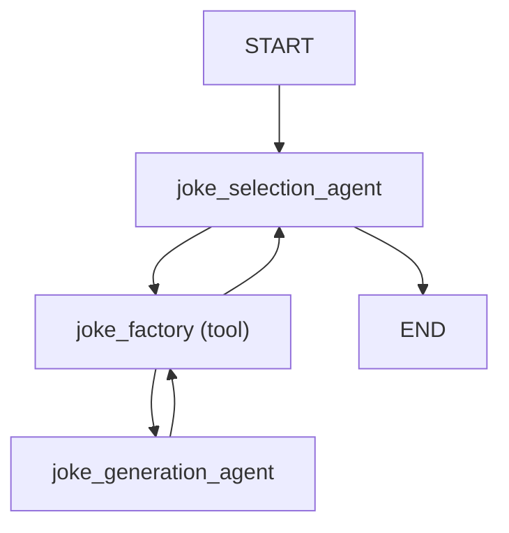
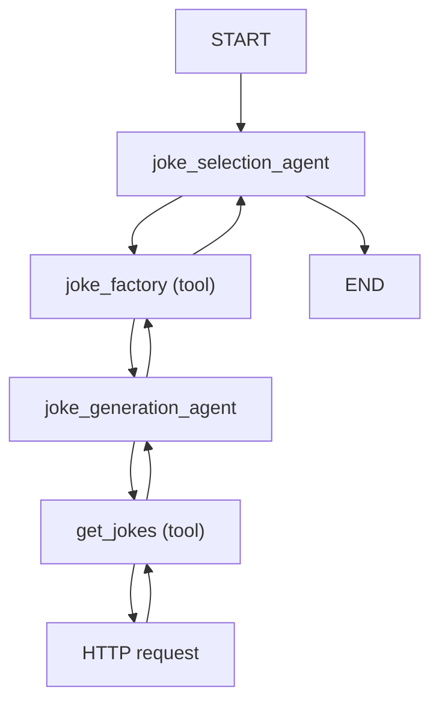
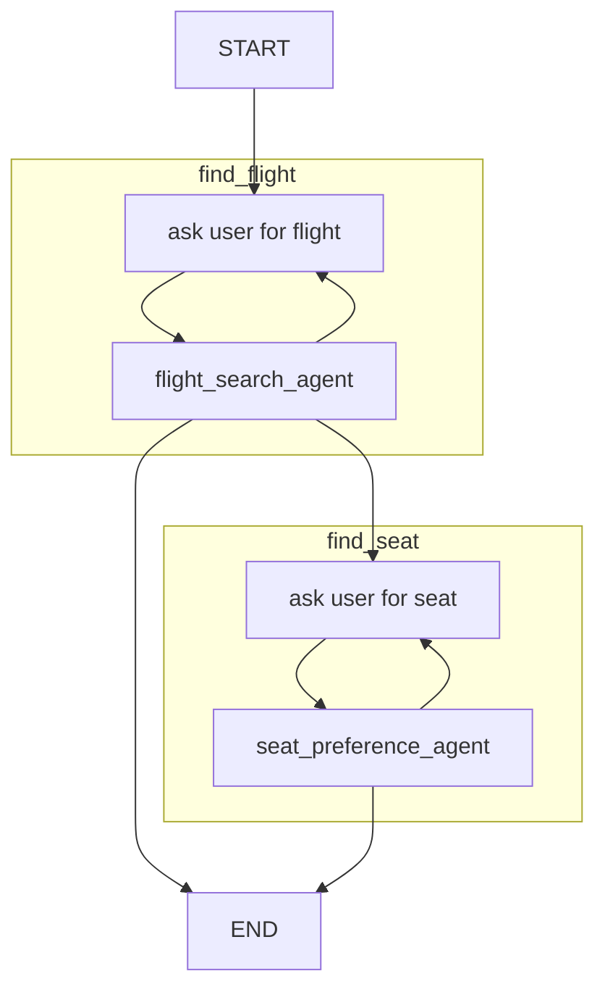

# 多 Agent 应用 {#multi-agent-applications}

使用 Pydantic AI 构建应用时，大致有五个复杂度层级：

1. 单 agent 工作流：`pydantic_ai` 文档的大多数内容都覆盖这一层
2. [Agent delegation](#agent-delegation)：agents 通过 tools 使用另一个 agent
3. [Programmatic agent hand-off](#programmatic-agent-hand-off)：一个 agent 先运行，然后应用代码调用另一个 agent
4. [基于 Graph 的控制流](graph.md)：对于最复杂的场景，可以使用基于 graph 的状态机来控制多个 agents 的执行
5. [Deep Agents](#deep-agents)：带规划、文件操作、任务委派和沙箱代码执行能力的自主 agents

当然，你可以在单个应用中组合多种策略。

## Agent delegation {#agent-delegation}

"Agent delegation" 指的是一个 agent 将工作委派给另一个 agent，并在被委派 agent（也就是从 tool 内调用的 agent）完成后重新接管控制的场景。
如果你想把控制完全交给另一个 agent，而不返回到第一个 agent，可以使用[输出函数](output.md#output-functions)。

由于 agents 是无状态并被设计为全局对象，因此不需要把 agent 本身包含在 agent [dependencies](dependencies.md) 中。

通常你会希望把 [`ctx.usage`][pydantic_ai.tools.RunContext.usage] 传给被委派 agent run 的 [`usage`][pydantic_ai.agent.AbstractAgent.run] 关键字参数，这样该 run 的 usage 会计入父 agent run 的总 usage。

!!! note "多个模型"
    Agent delegation 不需要每个 agent 都使用同一个模型。如果你选择在一次 run 内使用不同模型，则无法从该 run 最终的 [`result.usage`][pydantic_ai.agent.AgentRunResult.usage] 计算金钱成本；但你仍然可以使用 [`UsageLimits`][pydantic_ai.usage.UsageLimits]，包括 `request_limit`、`total_tokens_limit` 和 `tool_calls_limit`，以避免意外成本或失控的 tool loops。

```python {title="agent_delegation_simple.py"}
from pydantic_ai import Agent, RunContext, UsageLimits

joke_selection_agent = Agent(  # (1)!
    'openai:gpt-5.2',
    instructions=(
        'Use the `joke_factory` to generate some jokes, then choose the best. '
        'You must return just a single joke.'
    ),
)
joke_generation_agent = Agent(  # (2)!
    'google:gemini-3-flash-preview', output_type=list[str]
)


@joke_selection_agent.tool
async def joke_factory(ctx: RunContext[None], count: int) -> list[str]:
    r = await joke_generation_agent.run(  # (3)!
        f'Please generate {count} jokes.',
        usage=ctx.usage,  # (4)!
    )
    return r.output  # (5)!


result = joke_selection_agent.run_sync(
    'Tell me a joke.',
    usage_limits=UsageLimits(request_limit=5, total_tokens_limit=500),
)
print(result.output)
#> Did you hear about the toothpaste scandal? They called it Colgate.
print(result.usage)
#> RunUsage(input_tokens=165, output_tokens=24, requests=3, tool_calls=1)
```

1. "父" agent 或控制 agent。
2. "被委派" agent，也就是从父 agent 的 tool 内部调用的 agent。
3. 从父 agent 的 tool 内调用被委派 agent。
4. 将父 agent 的 usage 传给被委派 agent，这样最终的 [`result.usage`][pydantic_ai.agent.AgentRunResult.usage] 会同时包含两个 agents 的 usage。
5. 因为函数返回 `#!python list[str]`，且 `joke_generation_agent` 的 `output_type` 也是 `#!python list[str]`，所以可以直接从 tool 返回 `#!python r.output`。

_（这个示例是完整的，可以直接运行）_

这个示例的控制流相当简单，可以概括如下：



### Agent delegation 和 dependencies {#agent-delegation-and-dependencies}

通常，被委派 agent 需要拥有与调用方 agent 相同的 [dependencies](dependencies.md)，或拥有调用方 agent dependencies 的子集。

!!! info "初始化 dependencies"
    上面说 "通常"，是因为并没有什么阻止你在 tool call 内初始化 dependencies，并因此在被委派 agent 中使用父 agent 不可用的相互依赖项；但这通常应避免，因为相比复用父 agent 中的连接等资源，这可能明显更慢。

```python {title="agent_delegation_deps.py"}
from dataclasses import dataclass

import httpx

from pydantic_ai import Agent, RunContext


@dataclass
class ClientAndKey:  # (1)!
    http_client: httpx.AsyncClient
    api_key: str


joke_selection_agent = Agent(
    'openai:gpt-5.2',
    deps_type=ClientAndKey,  # (2)!
    instructions=(
        'Use the `joke_factory` tool to generate some jokes on the given subject, '
        'then choose the best. You must return just a single joke.'
    ),
)
joke_generation_agent = Agent(
    'google:gemini-3-flash-preview',
    deps_type=ClientAndKey,  # (4)!
    output_type=list[str],
    instructions=(
        'Use the "get_jokes" tool to get some jokes on the given subject, '
        'then extract each joke into a list.'
    ),
)


@joke_selection_agent.tool
async def joke_factory(ctx: RunContext[ClientAndKey], count: int) -> list[str]:
    r = await joke_generation_agent.run(
        f'Please generate {count} jokes.',
        deps=ctx.deps,  # (3)!
        usage=ctx.usage,
    )
    return r.output


@joke_generation_agent.tool  # (5)!
async def get_jokes(ctx: RunContext[ClientAndKey], count: int) -> str:
    response = await ctx.deps.http_client.get(
        'https://example.com',
        params={'count': count},
        headers={'Authorization': f'Bearer {ctx.deps.api_key}'},
    )
    response.raise_for_status()
    return response.text


async def main():
    async with httpx.AsyncClient() as client:
        deps = ClientAndKey(client, 'foobar')
        result = await joke_selection_agent.run('Tell me a joke.', deps=deps)
        print(result.output)
        #> Did you hear about the toothpaste scandal? They called it Colgate.
        print(result.usage)  # (6)!
        #> RunUsage(input_tokens=220, output_tokens=32, requests=4, tool_calls=2)
```

1. 定义一个 dataclass，用来保存 client 和 API key dependencies。
2. 设置调用方 agent（这里是 `joke_selection_agent`）的 `deps_type`。
3. 在 tool call 内，将 dependencies 传给被委派 agent 的 run 方法。
4. 同样设置被委派 agent（这里是 `joke_generation_agent`）的 `deps_type`。
5. 在被委派 agent 上定义一个使用 dependencies 发起 HTTP 请求的 tool。
6. Usage 现在包含 4 个 requests：2 个来自调用方 agent，2 个来自被委派 agent。

_（这个示例是完整的，可以直接运行；你需要添加 `asyncio.run(main())` 来运行 `main`）_

这个示例展示了，即使相当简单的 agent delegation，也可能带来复杂控制流：



## Programmatic agent hand-off {#programmatic-agent-hand-off}

"Programmatic agent hand-off" 指的是连续调用多个 agents 的场景，由应用代码和/或人在环路负责决定下一步调用哪个 agent。

这里 agents 不需要使用相同 deps。

下面展示了连续使用两个 agents：第一个用于查找航班，第二个用于提取用户的座位偏好。

```python {title="programmatic_handoff.py"}
from typing import Literal

from pydantic import BaseModel, Field
from rich.prompt import Prompt

from pydantic_ai import Agent, ModelMessage, RunContext, RunUsage, UsageLimits


class FlightDetails(BaseModel):
    flight_number: str


class Failed(BaseModel):
    """Unable to find a satisfactory choice."""


flight_search_agent = Agent[None, FlightDetails | Failed](  # (1)!
    'openai:gpt-5.2',
    output_type=FlightDetails | Failed,  # type: ignore
    instructions=(
        'Use the "flight_search" tool to find a flight '
        'from the given origin to the given destination.'
    ),
)


@flight_search_agent.tool  # (2)!
async def flight_search(
    ctx: RunContext[None], origin: str, destination: str
) -> FlightDetails | None:
    # in reality, this would call a flight search API or
    # use a browser to scrape a flight search website
    return FlightDetails(flight_number='AK456')


usage_limits = UsageLimits(request_limit=15)  # (3)!


async def find_flight(usage: RunUsage) -> FlightDetails | None:  # (4)!
    message_history: list[ModelMessage] | None = None
    for _ in range(3):
        prompt = Prompt.ask(
            'Where would you like to fly from and to?',
        )
        result = await flight_search_agent.run(
            prompt,
            message_history=message_history,
            usage=usage,
            usage_limits=usage_limits,
        )
        if isinstance(result.output, FlightDetails):
            return result.output
        else:
            message_history = result.all_messages(
                output_tool_return_content='Please try again.'
            )


class SeatPreference(BaseModel):
    row: int = Field(ge=1, le=30)
    seat: Literal['A', 'B', 'C', 'D', 'E', 'F']


# This agent is responsible for extracting the user's seat selection
seat_preference_agent = Agent[None, SeatPreference | Failed](  # (5)!
    'openai:gpt-5.2',
    output_type=SeatPreference | Failed,  # type: ignore
    instructions=(
        "Extract the user's seat preference. "
        'Seats A and F are window seats. '
        'Row 1 is the front row and has extra leg room. '
        'Rows 14, and 20 also have extra leg room. '
    ),
)


async def find_seat(usage: RunUsage) -> SeatPreference:  # (6)!
    message_history: list[ModelMessage] | None = None
    while True:
        answer = Prompt.ask('What seat would you like?')

        result = await seat_preference_agent.run(
            answer,
            message_history=message_history,
            usage=usage,
            usage_limits=usage_limits,
        )
        if isinstance(result.output, SeatPreference):
            return result.output
        else:
            print('Could not understand seat preference. Please try again.')
            message_history = result.all_messages()


async def main():  # (7)!
    usage: RunUsage = RunUsage()

    opt_flight_details = await find_flight(usage)
    if opt_flight_details is not None:
        print(f'Flight found: {opt_flight_details.flight_number}')
        #> Flight found: AK456
        seat_preference = await find_seat(usage)
        print(f'Seat preference: {seat_preference}')
        #> Seat preference: row=1 seat='A'
```

1. 定义第一个 agent，用来查找航班。在 [PEP-747](https://peps.python.org/pep-0747/) 落地前，我们使用显式类型注解，见[结构化输出](output.md#structured-output)。这里使用 union 作为输出类型，让模型可以表达无法找到满意选项；内部会把 union 的每个成员注册为单独 tool。
2. 在 agent 上定义一个查找航班的 tool。在这个简单场景中，可以不用 tool，而是直接定义 agent 返回结构化数据后再搜索航班；但在更复杂场景中，tool 会是必要的。
3. 为整个应用定义 usage limits。
4. 定义一个查找航班的函数，它询问用户偏好，然后调用 agent 查找航班。
5. 与上面的 `flight_search_agent` 一样，我们使用显式类型注解定义 agent。
6. 定义一个查找用户座位偏好的函数，它询问用户座位偏好，然后调用 agent 提取座位偏好。
7. 现在我们已经把运行每个 agent 的逻辑放进单独函数中，主应用变得非常简单。

_（这个示例是完整的，可以直接运行；你需要添加 `asyncio.run(main())` 来运行 `main`）_

这个示例的控制流可以概括如下：



## Pydantic Graphs

关于何时以及如何使用 graphs，请参阅 [graph](graph.md) 文档。

## Deep Agents {#deep-agents}

Deep agents 是自主 agents，它们结合多种架构模式和能力，以可靠处理复杂的多步骤任务。这些模式可以用 Pydantic AI 的内置功能和（第三方）toolsets 实现：

- **规划和进度跟踪**：agents 将复杂任务拆成步骤并跟踪进度，让用户看到 agent 正在做什么。见 [Task Management toolsets](toolsets.md#task-management)。
- **文件系统操作**：通过合适抽象层读取、写入和编辑文件，可跨内存存储、真实文件系统和沙箱容器工作。见 [File Operations toolsets](toolsets.md#file-operations)。
- **任务委派**：为特定任务生成 specialized sub-agents，并使用隔离上下文防止递归委派问题。见上面的 [Agent Delegation](#agent-delegation)。
- **沙箱代码执行**：在隔离环境（通常是 Docker containers）中运行 AI 生成的代码以防止意外。见 [Code Execution toolsets](toolsets.md#code-execution)。
- **上下文管理**：自动总结对话，以处理否则会超过 token 限制的长会话。见[处理消息历史](message-history.md#processing-message-history)。
- **人在环路**：为代码执行或文件删除等危险操作提供审批工作流。见[要求工具审批](toolsets.md#requiring-tool-approval)。
- **持久化执行**：跨瞬时 API 失败、应用错误或重启保留 agent 状态。见[持久化执行](durable_execution/overview.md)。

此外，社区维护了一些 packages，以更 opinionated 的方式把这些概念组合起来：

- [`pydantic-deep`](https://github.com/vstorm-co/pydantic-deepagents)，由 [Vstorm](https://vstorm.co/) 维护

## 观察多 Agent 系统 {#observing-multi-agent-systems}

由于复杂性，多 agent 系统可能很难调试；当多个 agents 交互时，理解执行流就变得非常重要。

### 跟踪 Agent Delegation {#tracing-agent-delegation}

借助 [Logfire](logfire.md)，你可以跟踪跨多个 agents 的完整流程：

```python
import logfire

logfire.configure()
logfire.instrument_pydantic_ai()

# Your multi-agent code here...
```

Logfire 会展示：

- **哪个 agent 处理了请求的哪一部分**
- **Delegation 决策**：一个 agent 何时以及为什么调用另一个 agent
- **端到端延迟**，按 agent 拆分
- **每个 agent 的 token usage 和 costs**
- **是什么触发了 agent run**：HTTP request、scheduled job 或启动它的用户动作
- **tool calls 内部发生了什么**：database queries、HTTP requests、file operations，以及 tools 执行的任何其他 instrumented code

这对于理解和优化复杂 agent 工作流非常重要。当多 agent 系统中出现问题时，你会准确看到哪个 agent 失败了、它当时试图做什么，以及问题是在 agent 推理中，还是在它调用的后端系统中。

### 全栈可见性 {#full-stack-visibility}

如果你的 Pydantic AI 应用包含 TypeScript frontend、API gateway，或其他语言编写的 services，Logfire 也可以跟踪它们。Logfire 提供 Python、JavaScript/TypeScript 和 Rust SDK，并兼容任何 OpenTelemetry-instrumented 应用。你可以在统一视图中查看整个 stack 的 traces。关于使用标准 OpenTelemetry 从其他语言发送数据的细节，请参阅[替代客户端指南](https://logfire.pydantic.dev/docs/how-to-guides/alternative-clients/)。

Pydantic AI 的 instrumentation 基于 [OpenTelemetry](https://opentelemetry.io/)，因此你也可以使用任何 OTel-compatible 后端。详情见 [Logfire 集成指南](logfire.md)。

## 示例 {#examples}

下面的示例演示如何在 Pydantic AI 中使用多 agent 模式：

- [Flight booking](examples/flight-booking.md)
