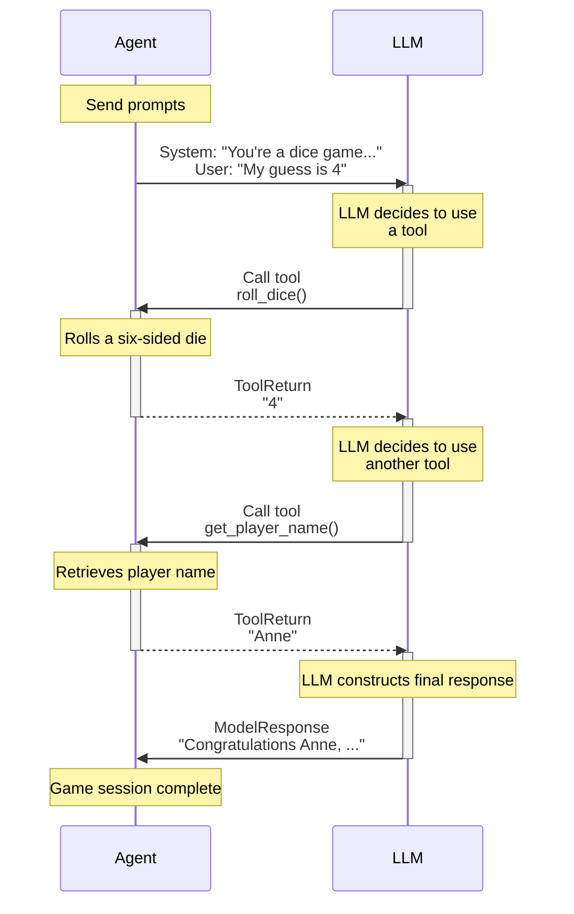

# 函数工具 {#function-tools}

Function tools 为模型提供一种机制，让它们可以执行动作并检索额外信息，以帮助生成响应。

当你想让模型执行某个动作并使用结果时，当把 agent 可能需要的所有上下文都放进 instructions 不现实或不可能时，或者当你希望通过把生成响应所需的部分逻辑委托给另一个（不一定由 AI 驱动的）工具来让 agents 的行为更确定或更可靠时，tools 很有用。

如果你希望模型可以把函数调用作为最终动作，而不把结果发回模型，可以改用[输出函数](output.md#output-functions)。

有多种方式可以向 agent 注册 tools：

- 通过 [`@agent.tool`][pydantic_ai.agent.Agent.tool] 装饰器：适用于需要访问 agent [context][pydantic_ai.tools.RunContext] 的 tools
- 通过 [`@agent.tool_plain`][pydantic_ai.agent.Agent.tool_plain] 装饰器：适用于不需要访问 agent [context][pydantic_ai.tools.RunContext] 的 tools
- 通过 `Agent` 的 [`tools`][pydantic_ai.agent.Agent.__init__] 关键字参数：可以接收普通函数，也可以接收 [`Tool`][pydantic_ai.tools.Tool] 实例

对于更高级的用例，[toolsets](toolsets.md) 功能允许你管理一组 tools（由你构建，或由 [MCP server](mcp/client.md) 或其他[第三方](third-party-tools.md#third-party-tools)提供），并通过 `Agent` 的 [`toolsets`][pydantic_ai.agent.Agent.__init__] 关键字参数一次性注册到 agent。内部会把所有 `tools` 和 `toolsets` 收集到一个[组合 toolset](toolsets.md#combining-toolsets) 中，提供给模型使用。

!!! info "Function tools 与 RAG"
    Function tools 基本上是 RAG（Retrieval-Augmented Generation）中的 "R"：它们通过让模型请求额外信息，扩展模型能做的事情。

    Pydantic AI Tools 和 RAG 的主要语义区别在于，RAG 通常等同于向量搜索，而 Pydantic AI tools 更通用。对于向量搜索，你可以使用我们的 [embeddings](embeddings.md) 支持，跨多个 providers 生成 embeddings。

!!! info "Function Tools 与 Structured Outputs"
    顾名思义，function tools 使用模型的 "tools" 或 "functions" API 告诉模型有哪些内容可以调用。使用默认[工具输出模式](output.md#tool-output)时，tools 或 functions 也用于定义[结构化输出](output.md)的 schema。因此，模型可能可以访问许多 tools，其中一些调用 function tools，另一些则结束运行并生成最终输出。

## 通过装饰器注册 {#registering-function-tools-via-decorator}

`@agent.tool` 被视为默认装饰器，因为大多数情况下 tools 都需要访问 agent [context][pydantic_ai.tools.RunContext]。

下面是一个同时使用两种装饰器的示例：

```python {title="dice_game.py"}
import random

from pydantic_ai import Agent, RunContext

agent = Agent(
    'google:gemini-3-flash-preview',  # (1)!
    deps_type=str,  # (2)!
    instructions=(
        "You're a dice game, you should roll the die and see if the number "
        "you get back matches the user's guess. If so, tell them they're a winner. "
        "Use the player's name in the response."
    ),
)


@agent.tool_plain  # (3)!
def roll_dice() -> str:
    """Roll a six-sided die and return the result."""
    return str(random.randint(1, 6))


@agent.tool  # (4)!
def get_player_name(ctx: RunContext[str]) -> str:
    """Get the player's name."""
    return ctx.deps


dice_result = agent.run_sync('My guess is 4', deps='Anne')  # (5)!
print(dice_result.output)
#> Congratulations Anne, you guessed correctly! You're a winner!
```

1. 这是个相当简单的任务，因此可以使用快速且便宜的 Gemini flash 模型。
2. 我们把用户姓名作为依赖传入；为了简单起见，这里只用字符串形式的姓名作为依赖。
3. 这个 tool 不需要任何 context，只返回一个随机数。在这个场景中也可能使用 dynamic instructions。
4. 这个 tool 需要玩家姓名，因此使用 `RunContext` 访问依赖；这里依赖就是玩家姓名。
5. 运行 agent，并把玩家姓名作为依赖传入。

_（这个示例是完整的，可以直接运行）_

我们打印这局游戏的消息，看看发生了什么：

```python {title="dice_game_messages.py" requires="dice_game.py"}
from dice_game import dice_result

print(dice_result.all_messages())
"""
[
    ModelRequest(
        parts=[
            UserPromptPart(
                content='My guess is 4',
                timestamp=datetime.datetime(...),
            )
        ],
        timestamp=datetime.datetime(...),
        instructions="You're a dice game, you should roll the die and see if the number you get back matches the user's guess. If so, tell them they're a winner. Use the player's name in the response.",
        run_id='...',
        conversation_id='...',
    ),
    ModelResponse(
        parts=[
            ToolCallPart(
                tool_name='roll_dice', args={}, tool_call_id='pyd_ai_tool_call_id'
            )
        ],
        usage=RequestUsage(input_tokens=54, output_tokens=2),
        model_name='gemini-3-flash-preview',
        timestamp=datetime.datetime(...),
        run_id='...',
        conversation_id='...',
    ),
    ModelRequest(
        parts=[
            ToolReturnPart(
                tool_name='roll_dice',
                content='4',
                tool_call_id='pyd_ai_tool_call_id',
                timestamp=datetime.datetime(...),
            )
        ],
        timestamp=datetime.datetime(...),
        instructions="You're a dice game, you should roll the die and see if the number you get back matches the user's guess. If so, tell them they're a winner. Use the player's name in the response.",
        run_id='...',
        conversation_id='...',
    ),
    ModelResponse(
        parts=[
            ToolCallPart(
                tool_name='get_player_name', args={}, tool_call_id='pyd_ai_tool_call_id'
            )
        ],
        usage=RequestUsage(input_tokens=55, output_tokens=4),
        model_name='gemini-3-flash-preview',
        timestamp=datetime.datetime(...),
        run_id='...',
        conversation_id='...',
    ),
    ModelRequest(
        parts=[
            ToolReturnPart(
                tool_name='get_player_name',
                content='Anne',
                tool_call_id='pyd_ai_tool_call_id',
                timestamp=datetime.datetime(...),
            )
        ],
        timestamp=datetime.datetime(...),
        instructions="You're a dice game, you should roll the die and see if the number you get back matches the user's guess. If so, tell them they're a winner. Use the player's name in the response.",
        run_id='...',
        conversation_id='...',
    ),
    ModelResponse(
        parts=[
            TextPart(
                content="Congratulations Anne, you guessed correctly! You're a winner!"
            )
        ],
        usage=RequestUsage(input_tokens=56, output_tokens=12),
        model_name='gemini-3-flash-preview',
        timestamp=datetime.datetime(...),
        run_id='...',
        conversation_id='...',
    ),
]
"""
```

可以用图表示这个过程：



## 通过 Agent 参数注册 {#registering-function-tools-via-agent-argument}

除了使用装饰器，也可以通过 [`Agent` 构造函数][pydantic_ai.agent.Agent.__init__]的 `tools` 参数注册 tools。当你想复用 tools，或者想更细粒度控制 tools 时，这很有用。

```python {title="dice_game_tool_kwarg.py"}
import random

from pydantic_ai import Agent, RunContext, Tool

instructions = """\
You're a dice game, you should roll the die and see if the number
you get back matches the user's guess. If so, tell them they're a winner.
Use the player's name in the response.
"""


def roll_dice() -> str:
    """Roll a six-sided die and return the result."""
    return str(random.randint(1, 6))


def get_player_name(ctx: RunContext[str]) -> str:
    """Get the player's name."""
    return ctx.deps


agent_a = Agent(
    'google:gemini-3-flash-preview',
    deps_type=str,
    tools=[roll_dice, get_player_name],  # (1)!
    instructions=instructions,
)
agent_b = Agent(
    'google:gemini-3-flash-preview',
    deps_type=str,
    tools=[  # (2)!
        Tool(roll_dice, takes_ctx=False),
        Tool(get_player_name, takes_ctx=True),
    ],
    instructions=instructions,
)

dice_result = {}
dice_result['a'] = agent_a.run_sync('My guess is 6', deps='Yashar')
dice_result['b'] = agent_b.run_sync('My guess is 4', deps='Anne')
print(dice_result['a'].output)
#> Tough luck, Yashar, you rolled a 4. Better luck next time.
print(dice_result['b'].output)
#> Congratulations Anne, you guessed correctly! You're a winner!
```

1. 通过 `Agent` 构造函数注册 tools 的最简单方式是传入函数列表；函数签名会被检查，以判断该 tool 是否接收 [`RunContext`][pydantic_ai.tools.RunContext]。
2. `agent_a` 和 `agent_b` 是等价的，但我们可以使用 [`Tool`][pydantic_ai.tools.Tool] 来复用 tool 定义，并更细粒度控制 tools 的定义方式，例如设置名称或描述，或使用自定义 [`prepare`](tools-advanced.md#tool-prepare) 方法。

_（这个示例是完整的，可以直接运行）_

## 工具输出 {#function-tool-output}

Tools 可以返回任何 Pydantic 能序列化为 JSON 的内容。关于包括多模态内容和 metadata 在内的高级输出选项，请参阅[高级工具功能](tools-advanced.md#function-tool-output)。

## 工具 Schema {#function-tools-and-schema}

函数参数会从函数签名中提取，除 `RunContext` 之外的所有参数都会用于构建该 tool call 的 schema。

更进一步，Pydantic AI 会从函数提取 docstring，并且（借助 [griffe](https://mkdocstrings.github.io/griffe/)）从 docstring 中提取参数描述并添加到 schema。

[Griffe 支持](https://mkdocstrings.github.io/griffe/reference/docstrings/#docstrings)从 `google`、`numpy` 和 `sphinx` 风格 docstrings 中提取参数描述。Pydantic AI 会根据 docstring 推断要使用的格式，但你也可以通过 [`docstring_format`][pydantic_ai.tools.DocstringFormat] 显式设置。也可以通过设置 `require_parameter_descriptions=True` 强制要求参数描述。如果缺少参数描述，会抛出 [`UserError`][pydantic_ai.exceptions.UserError]。

为了演示 tool 的 schema，这里使用 [`FunctionModel`][pydantic_ai.models.function.FunctionModel] 打印模型会收到的 schema：

```python {title="tool_schema.py"}
from pydantic_ai import Agent, ModelMessage, ModelResponse, TextPart
from pydantic_ai.models.function import AgentInfo, FunctionModel

agent = Agent()


@agent.tool_plain(docstring_format='google', require_parameter_descriptions=True)
def foobar(a: int, b: str, c: dict[str, list[float]]) -> str:
    """Get me foobar.

    Args:
        a: apple pie
        b: banana cake
        c: carrot smoothie
    """
    return f'{a} {b} {c}'


def print_schema(messages: list[ModelMessage], info: AgentInfo) -> ModelResponse:
    tool = info.function_tools[0]
    print(tool.description)
    #> Get me foobar.
    print(tool.parameters_json_schema)
    """
    {
        'additionalProperties': False,
        'properties': {
            'a': {'description': 'apple pie', 'type': 'integer'},
            'b': {'description': 'banana cake', 'type': 'string'},
            'c': {
                'additionalProperties': {'items': {'type': 'number'}, 'type': 'array'},
                'description': 'carrot smoothie',
                'type': 'object',
            },
        },
        'required': ['a', 'b', 'c'],
        'type': 'object',
    }
    """
    return ModelResponse(parts=[TextPart('foobar')])


agent.run_sync('hello', model=FunctionModel(print_schema))
```

_（这个示例是完整的，可以直接运行）_

如果 tool 只有一个参数，并且该参数可以在 JSON schema 中表示为对象（例如 dataclass、TypedDict、pydantic model），则该 tool 的 schema 会简化为该对象本身。

下面的示例使用 [`TestModel.last_model_request_parameters`][pydantic_ai.models.test.TestModel.last_model_request_parameters] 检查会传给模型的 tool schema。

```python {title="single_parameter_tool.py"}
from pydantic import BaseModel

from pydantic_ai import Agent
from pydantic_ai.models.test import TestModel

agent = Agent()


class Foobar(BaseModel):
    """This is a Foobar"""

    x: int
    y: str
    z: float = 3.14


@agent.tool_plain
def foobar(f: Foobar) -> str:
    return str(f)


test_model = TestModel()
result = agent.run_sync('hello', model=test_model)
print(result.output)
#> {"foobar":"x=0 y='a' z=3.14"}
print(test_model.last_model_request_parameters.function_tools)
"""
[
    ToolDefinition(
        name='foobar',
        parameters_json_schema={
            'properties': {
                'x': {'type': 'integer'},
                'y': {'type': 'string'},
                'z': {'default': 3.14, 'type': 'number'},
            },
            'required': ['x', 'y'],
            'title': 'Foobar',
            'type': 'object',
        },
        description='This is a Foobar',
    )
]
"""
```

_（这个示例是完整的，可以直接运行）_


!!! tip "调试工具调用"
    理解 tool 行为对 agent 开发很关键。通过用 [Logfire](logfire.md) 对 agent 做 instrumentation，你可以看到：

    - 传给每个 tool 的参数
    - 每个 tool 返回了什么
    - 每个 tool 执行耗时
    - 发生的任何错误

    这种可见性有助于理解 agent 为什么做出特定决策，并识别 tool 实现中的问题。

## 从工具注入后续消息 {#injecting-follow-up-messages-from-a-tool}

工具可以通过 [`RunContext.enqueue`][pydantic_ai.tools.RunContext.enqueue] 向对话中推入额外消息；当工具想添加后续上下文、重定向 agent 的计划，或暴露一个模型应当响应的事件时，这很有用。完整模式见[运行中注入消息](message-history.md#injecting-messages-mid-run)。

## 另见 {#see-also}

更多工具功能和集成见：

- [高级工具功能](tools-advanced.md) - 自定义 schemas、动态 tools、tool 执行和重试
- [Toolsets](toolsets.md) - 管理工具集合
- [Native Tools](native-tools.md) - LLM providers 提供的原生 tools
- [常用工具](common-tools.md) - 开箱即用的 tool 实现
- [第三方工具](third-party-tools.md) - 与 MCP、LangChain、ACI.dev 和其他 tool libraries 的集成
- [Deferred Tools](deferred-tools.md) - 需要审批或外部执行的 tools
